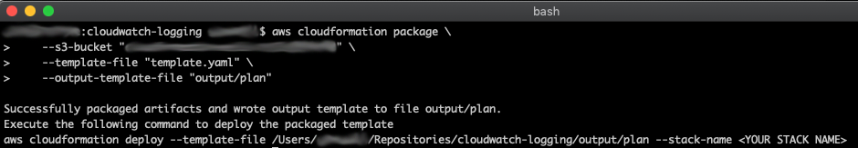
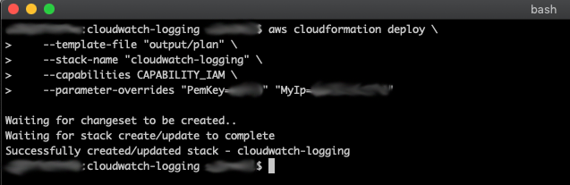
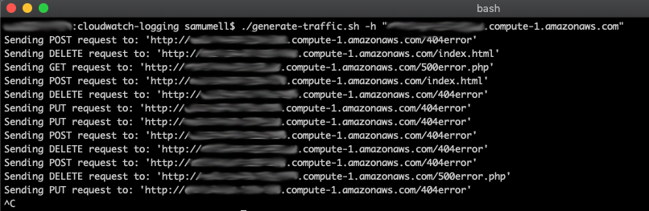

# Cloudwatch Logging
Within CloudWatch exists a feature called LogGroups which, when combined with CloudWatch Agent, can pipe logs to custom LogGroups, allowing for a single-pane-of-glass for log analysis and alerting.

This proof-of-concept creates AWS resources in order to demo the aforementioned functionality.

**Architecture Diagram**


Utilizing CloudWatch, your custom applications can benefit from alarms, event rules, and other CloudWatch features to monitor & detect problems in real time.

**Resources Created**:
1. Security Group provisioned in default VPC allowing port 22 and 80 for a provided IP address.
2. IAM Role using two managed IAM policies: 
   1. CloudWatchAgentServerPolicy
   2. AmazonSSMManagedInstanceCore
3. CloudWatch LogGroups
4. CloudWatch MetricFilters
5. Custom CloudWatch Dashboard for Apache
6. EC2 Instance Profile using the created IAM Role.
7. EC2 Instance using Security Group and IAM Instance Profile.
8. Systems Manager Parameter for CloudWatch configuration file.
9. Systems Manager State Manager Document that:
    1.  Provisions CloudWatch Agent
    2.  Installs & Configures HTTPD
    3.  Configures CloudWatch Agent
10. Systems Manager Association for EC2 instance configuration from command document.

---

## Prerequisites
- AWS CLI
  - And a valid profile configured (see [configuring aws cli](https://docs.aws.amazon.com/cli/latest/userguide/cli-chap-configure.html))
- Terminal with Curl (bash, etc.)
- Existing S3 Bucket in your AWS account that your authenticating user has permission to.
- Default VPC defined.

---

## Deploying
The process of deploying is that of any other CloudFormation template ([see "getting started" documentation](https://docs.aws.amazon.com/AWSCloudFormation/latest/UserGuide/GettingStarted.Walkthrough.html)) and uses the AWS CLI with the following commands to create a CloudFormation stack (see prerequisites for additional configuration).

1. First, a CloudFormation package must be created with the following command in your terminal:

```
aws cloudformation package \
    --s3-bucket "<your-s3-bucket>" \
    --template-file "template.yaml" \
    --output-template-file "output/plan"
```

Replace ```<your-s3-bucket>``` with the name of your S3 bucket that you have access to, and then run the command.

Upon completion you should see:



2. Once completed, trigger the CloudFormation deployment with:

```
aws cloudformation deploy \
    --template-file "output/plan" \
    --stack-name "<stack-name>" \
    --capabilities CAPABILITY_IAM \
    --parameter-overrides "PemKey=<key-name>" "MyIp=<ip-address>"
```

...replacing the following variables:
- ```<stack-name>```: The desired name of your stack in CloudFormation
- ```<key-name>```: The Key pair name you wish to use for the EC2 instance (see [your key pairs](https://console.aws.amazon.com/ec2/v2/home?#KeyPairs:)).
- ```<ip-address>```: Your IP address to allow port 22 and 80 access for on the EC2 instance.
- **NOTE**: _Consult the [template.yaml](./template.yaml) file for other parameter overrides._

The result should be (assuming you named your stack "cloudwatch-logging"):



**POST-DEPLOYMENT**: _After deployment succeeds, you will want to start generating traffic in order to get data into the generated CloudWatch dashboard. See the "Generating Traffic" section for how to accomplish this._

---

## Generating Traffic
After you've created the instance you can generate some traffic by running the ```generate-traffic.sh``` bash script included in this repository. This will randomly choose between GET, PUT, POST, and DELETE methods while constructing a Curl request to the host name you provide. 

It will also determine whether to make the request a 404, 500, or not by requesting a path that doesn't exist or calling a PHP script that intentionally throws a server error. The point of this is to generate traffic for graphing examples.

Example:

```./generate-traffic.sh -h "<host-name>"```

Replace ```<host-name>``` with the public DNS or IP address of the EC2 instance (visit [ec2 instances](https://console.aws.amazon.com/ec2/v2/home?#Instances:sort=tag:Name) to find the created instance).

The expected output will be:



**NOTE**: _The script will continue to loop until you manually intervene. Press ```ctrl+c``` to quit._

---

## Dashboard
As part of this template, a CloudWatch dashboard is created to visualize metric analysis of Apache logs. 


Visit the following URL to see the dashboard and widgets in your console (once you've deployed the template):

https://console.aws.amazon.com/cloudwatch/home?dashboards:name=Apache#dashboards:name=Apache