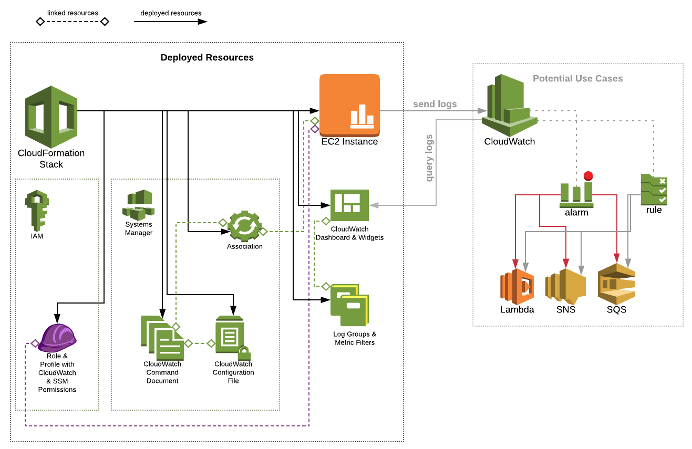
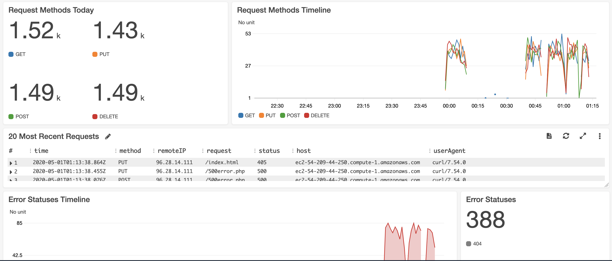

# Cloudwatch Logging
Within CloudWatch exists a feature called LogGroups which, when combined with CloudWatch Agent, can pipe logs to custom groups, allowing for a single-pane-of-glass for log analysis and alerting.

This POC creates resources in order to demo the functionality.

**Architecture Diagram**



Utilizing CloudWatch, your custom applications can benefit from alarms, event rules, and other CloudWatch features to monitor & detect problems before your users experience them.

**Resources Created**:
1. Security Group provisioned in default VPC allowing port 22 and 80 for a provided IP address.
2. IAM Role using two managed IAM policies: 
   1. CloudWatchAgentServerPolicy
   2. AmazonSSMManagedInstanceCore
3. CloudWatch LogGroups:
   1. apache/access
   2. apache/error
4. CloudWatch MetricFilters:
   1. GET
   2. PUT
   3. POST
   4. DELETE
   5. 404
   6. 500
   7. 405
   8. 200
   9. Core Errors
5. Custom CloudWatch Dashboard for Apache
6. EC2 Instance Profile using the aforementioned IAM Role.
7. EC2 Instance using Security Group and IAM Instance Profile.
8. Systems Manager Parameter:
   1. CloudWatch vonfiguration file.
9.  Systems Manager State Manager Document:
    1.  Provisions CloudWatch Agent
    2.  Installs & Configures HTTPD
    3.  Configures CloudWatch Agent
10. Systems Manager Association for instance to document.

---

## Pre-Requisites
- AWS CLI
  - And a valid profile configured (see [configuring aws cli](https://docs.aws.amazon.com/cli/latest/userguide/cli-chap-configure.html))
- Terminal with Curl (bash, etc.)

---

## Deploying
The process of deploying is that of any other CloudFormation template ([see "getting started" documentation](https://docs.aws.amazon.com/AWSCloudFormation/latest/UserGuide/GettingStarted.Walkthrough.html)) and uses the AWS CLI with the following commands.

First, a CloudFormation package must be created with:

```
aws cloudformation package \
    --profile "<profile>" \
    --s3-bucket "<s3-bucket>" \
    --template-file "<template-file>" \
    --output-template-file "<output-file>"
```

And then the CloudFormation deployment must be triggered with:

```
aws cloudformation deploy \
    --profile "<profile>" \
    --template-file "<output-file>" \
    --stack-name "<stack-name"> \
    --capabilities CAPABILITY_IAM \
    --parameter-overrides "<override-item>"
```

For both commands, you must replace the values above with values related to your environment. For parameter overrides, reference the template file "parameters" definition.

---

## Generating Traffic
After you've created the instance you can generate some traffic by running the ```generate-traffic.sh``` bash script included in this repository. This will randomly choose between GET, PUT, POST, and DELETE methods while constructing a Curl request to the host name you provide. 

It will also determine whether to make the request a 404, 500, or not by requesting a path that doesn't exist or calling a PHP script that intentionally throws a server error. The point of this is to generate traffic for graphing examples.

Example:

```./generate-traffic.sh -h "<host-name>"```

Script assumes port 80.

---

## Dashboards
As part of this template, a CloudWatch dashboard is created to visualize metric analysis of Apache logs. 



Visit the following URL to see the dashboard and widgets in your console:

https://console.aws.amazon.com/cloudwatch/home?dashboards:name=Apache#dashboards:name=Apache